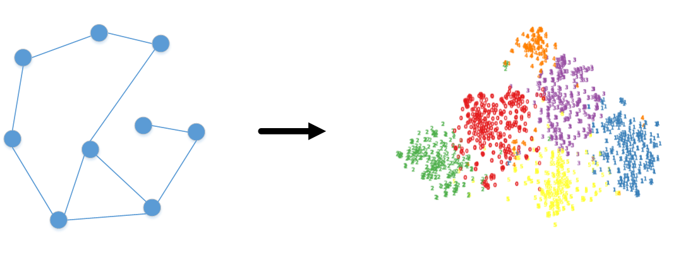

[python-img]: https://img.shields.io/github/languages/top/yueliu1999/Awesome-Deep-Graph-Clustering?color=lightgrey
[stars-img]: https://img.shields.io/github/stars/yueliu1999/Awesome-Deep-Graph-Clustering?color=yellow
[stars-url]: https://github.com/yueliu1999/Awesome-Deep-Graph-Clustering/stargazers
[fork-img]: https://img.shields.io/github/forks/yueliu1999/Awesome-Deep-Graph-Clustering?color=lightblue&label=fork
[fork-url]: https://github.com/yueliu1999/Awesome-Deep-Graph-Clustering/network/members
[visitors-img]: https://visitor-badge.glitch.me/badge?page_id=yueliu1999.Awesome-Deep-Graph-Clustering
[adgc-url]: https://github.com/yueliu1999/Awesome-Deep-Graph-Clustering

# ADGC: Awesome Deep Graph Clustering

ADGC is a collection of state-of-the-art (SOTA), novel deep graph clustering methods (papers, codes and datasets). Any other interesting papers and codes are welcome. Any problems, please contact yueliu19990731@163.com. If you find this repository useful to your research or work, it is really appreciated to star this repository. :heart:

[![Made with Python][python-img]][adgc-url]
[![GitHub stars][stars-img]][stars-url]
[![GitHub forks][fork-img]][fork-url]
[![visitors][visitors-img]][adgc-url]

--------------

## What's Deep Graph Clustering?

Deep graph clustering, which aims to reveal the underlying graph structure and divide the nodes into different groups, has attracted intensive attention in recent years.

<div  align="center">    
    
</div>


​    


## Important Survey Papers

1. "A survey of clustering with deep learning: From the perspective of network architecture" \[[paper](https://ieeexplore.ieee.org/stamp/stamp.jsp?arnumber=8412085)]


## Papers

#### Traditional Clustering

1. K-Means: "Algorithm AS 136: A k-means clustering algorithm" \[[paper](http://danida.vnu.edu.vn/cpis/files/Refs/LAD/Algorithm%20AS%20136-%20A%20K-Means%20Clustering%20Algorithm.pdf)|[code](https://github.com/src-d/kmcuda)]

#### Deep Clustering

1. DEC (ICML 16): "Unsupervised Deep Embedding for Clustering Analysis" \[[paper](http://proceedings.mlr.press/v48/xieb16.pdf)|[code](https://github.com/piiswrong/dec)]
2. IDEC (IJCAI 17): "Improved Deep Embedded Clustering with Local Structure Preservation" \[[paper](https://www.researchgate.net/profile/Xifeng-Guo/publication/317095655_Improved_Deep_Embedded_Clustering_with_Local_Structure_Preservation/links/59263224458515e3d4537edc/Improved-Deep-Embedded-Clustering-with-Local-Structure-Preservation.pdf)|[code](https://github.com/XifengGuo/IDEC)]
3. DCN (ICML 17): "Towards k-means-friendly spaces: Simultaneous deep learning and clustering"  \[[paper](http://proceedings.mlr.press/v70/yang17b/yang17b.pdf)|[code](https://github.com/boyangumn/DCN)]
4. CC (AAAI 21): "Contrastive Clustering" \[[paper](https://arxiv.org/pdf/2009.09687.pdf)|[code](https://github.com/Yunfan-Li/Contrastive-Clustering)]
5. Ada-Net (ICLR 22): "Ada-nets: Face clustering via adaptive neighbour discovery in the structure space" \[[paper](https://arxiv.org/pdf/2202.03800)|[code](https://github.com/damo-cv/Ada-NETS)]

#### Generative Deep Graph Clustering

1. SAE (AAAI 14): "Learning Deep Representations for Graph Clustering" \[[paper](https://ojs.aaai.org/index.php/AAAI/article/view/8916/8775)|[code](https://github.com/quinngroup/deep-representations-clustering)]
2. GAE/VGAE (NeurIPS 16): "Variational Graph Auto-Encoders" \[[paper](https://arxiv.org/pdf/1611.07308.pdf%5D)|[code](https://github.com/tkipf/gae)]
3. MGAE (CIKM 17): "MGAE: Marginalized Graph Autoencoder for Graph Clustering" \[[paper](https://www.researchgate.net/profile/Shirui-Pan-3/publication/320882195_MGAE_Marginalized_Graph_Autoencoder_for_Graph_Clustering/links/5b76157b45851546c90a3d74/MGAE-Marginalized-Graph-Autoencoder-for-Graph-Clustering.pdf)|[code](https://github.com/GRAND-Lab/MGAE)]
4. NetVAE (IJCAI 19): "Network-Specific Variational Auto-Encoder for Embedding in Attribute Networks" \[[paper](https://www.ijcai.org/proceedings/2019/370)]
5. DAEGC (IJCAI 19): "Attributed Graph Clustering: A Deep Attentional Embedding Approach" \[[paper](https://www.ijcai.org/proceedings/2019/0509.pdf)|[code](https://github.com/Tiger101010/DAEGC)]
6. GALA (ICCV 19): "Symmetric Graph Convolutional Autoencoder for Unsupervised Graph Representation Learning" \[[paper](https://openaccess.thecvf.com/content_ICCV_2019/papers/Park_Symmetric_Graph_Convolutional_Autoencoder_for_Unsupervised_Graph_Representation_Learning_ICCV_2019_paper.pdf)|[code](https://github.com/sseung0703/GALA_TF2.0)]
7. RWR-GAE (arXiv 19): "RWR-GAE: Random Walk Regularization for Graph Auto Encoders" \[[paper](https://arxiv.org/pdf/1908.04003)|[code](https://github.com/MysteryVaibhav/RWR-GAE)]
8. DGVAE (NeurIPS 20): "Dirichlet Graph Variational Autoencoder" \[[paper](https://proceedings.neurips.cc/paper/2020/file/38a77aa456fc813af07bb428f2363c8d-Paper.pdf)|[code](https://github.com/xiyou3368/DGVAE)]
9. SDCN/SDCN_Q (WWW 20): "Structural Deep Clustering Network" \[[paper](https://arxiv.org/pdf/2002.01633)|[code](https://github.com/bdy9527/SDCN)]
10. O2MAC (WWW 20): "One2Multi Graph Autoencoder for Multi-view Graph Clustering" \[[paper](http://shichuan.org/doc/83.pdf)|[code](https://github.com/googlebaba/WWW2020-O2MAC)]
11. CGCN/GMM-VGAE (AAAI 20): "Collaborative Graph Convolutional Networks: Unsupervised Learning Meets Semi-Supervised Learning" \[[paper](https://ojs.aaai.org/index.php/AAAI/article/download/5843/5699)|[code](https://github.com/nairouz/R-GAE/tree/master/GMM-VGAE)]
12. DFCN (AAAI 21): "Deep Fusion Clustering Network" \[[paper](https://ojs.aaai.org/index.php/AAAI/article/view/17198/17005)|[code](https://github.com/WxTu/DFCN)]
13. R-GAE (arXiv 21): "Rethinking Graph Auto-Encoder Models for Attributed Graph Clustering" \[[paper](https://arxiv.org/pdf/2107.08562)|[code](https://github.com/nairouz/R-GAE)]
14. AGCN (MM 21): "Attention-driven Graph Clustering Network" \[[paper](https://arxiv.org/pdf/2108.05499)|[code](https://github.com/ZhihaoPENG-CityU/AGCN)]
15. DAGC (arXiv 21, extension of AGCN): ”Deep Attention-guided Graph Clustering with Dual Self-supervision“ \[[paper](https://arxiv.org/abs/2111.05548)|[code](https://github.com/ZhihaoPENG-CityU/DAGC)]
16. AdaGAE (TPAMI 21): "Adaptive Graph Auto-Encoder for General Data Clustering" \[[paper](https://ieeexplore.ieee.org/stamp/stamp.jsp?tp=&arnumber=9606581)|[code](https://github.com/hyzhang98/AdaGAE)]
17. AHGAE (TKDE 21): "Adaptive Hypergraph Auto-Encoder for Relational Data Clustering" \[[paper](https://ieeexplore.ieee.org/iel7/69/4358933/09525190.pdf%3Fcasa_token%3DmbL8SLkmu8AAAAAA:mNPoE2n3BwaMZsYdRotHwa8Qs3uyzY53ZPVd0ixXutwqovM4vA7OSmsYWN3qXOAGW3CgH-LugHo&hl=en&sa=T&oi=ucasa&ct=ucasa&ei=_dvpYcTXCcCVy9YPgta4-AM&scisig=AAGBfm2V50SkaPV0K8x2F_mYsC15x028wA)]
18. EGAE (TNNLS 22): "Embedding Graph Auto-Encoder for Graph Clustering"\[[paper](https://ieeexplore.ieee.org/document/9741755)|[code](https://github.com/hyzhang98/EGAE)]
19. GC-VGE (PR 22): "Graph Clustering via Variational Graph Embedding" \[[paper](https://www.sciencedirect.com/science/article/abs/pii/S0031320321005148)]
20. GCC (WSDM 22): "Efficient Graph Convolution for Joint Node Representation Learning and Clustering" \[[paper](https://dl.acm.org/doi/pdf/10.1145/3488560.3498533)|[code](https://github.com/chakib401/graph_convolutional_clustering)]
21. scTAG (AAAI 22): "ZINB-based Graph Embedding Autoencoder for Single-cell RNA-seq Interpretations" \[[paper](https://www.aaai.org/AAAI22Papers/AAAI-5060.YuZ.pdf)|[code](https://github.com/Philyzh8/scTAG)]

#### Adversarial Deep Graph Clustering

1. AGAE (IJCAI 19): "Adversarial Graph Embedding for Ensemble Clustering" \[[paper](https://par.nsf.gov/servlets/purl/10113653)]
2. ARGA/ARVGA (TCYB 19): "Learning Graph Embedding with Adversarial Training Methods" \[[paper](https://arxiv.org/pdf/1901.01250)|[code](https://github.com/GRAND-Lab/ARGA)]
3. WARGA (arXiv 21): "Wasserstein Adversarially Regularized Graph Autoencoder" \[[paper](https://arxiv.org/pdf/2111.04981)|[code](https://github.com/LeonResearch/WARGA)]

#### Contrastive Deep Graph Clustering

1. MVGRL (ICML 20): "Contrastive Multi-View Representation Learning on Graphs" \[[paper](http://proceedings.mlr.press/v119/hassani20a/hassani20a.pdf)|[code](https://github.com/kavehhassani/mvgrl)]
2. AGE (SIGKDD 20): "Adaptive Graph Encoder for Attributed Graph Embedding" \[[paper](https://arxiv.org/pdf/2007.01594)|[code](https://github.com/thunlp/AGE)]
3. MCGC (NeurIPS 21): "Multi-view Contrastive Graph Clustering" \[[paper](https://papers.nips.cc/paper/2021/file/10c66082c124f8afe3df4886f5e516e0-Paper.pdf)|[code](https://github.com/panern/mcgc)]
4. SCAGC (arXiv 21): "Self-supervised Contrastive Attributed Graph Clustering" \[[paper](https://arxiv.org/abs/2110.08264)]
5. MGCCN (arXiv 21): "Multilayer Graph Contrastive Clustering Network" \[[paper](https://arxiv.org/pdf/2112.14021)]
6. GDCL (IJCAI 21): "Graph Debiased Contrastive Learning with Joint Representation Clustering" \[[paper](https://www.ijcai.org/proceedings/2021/0473.pdf)|[code](https://github.com/hzhao98/GDCL)]
7. GCC (ICCV 21): "Graph Contrastive Clustering" \[[paper](https://arxiv.org/pdf/2104.01429)|[code](https://github.com/mynameischaos/GCC)]
9. SAIL(AAAI 22): "SAIL: Self-Augmented Graph Contrastive Learning" \[[paper](https://arxiv.org/abs/2009.00934)]
10. DCRN (AAAI 22): "Deep Graph Clustering via Dual Correlation Reduction" \[[paper](https://www.researchgate.net/profile/Yue-Liu-240/publication/357271184_Deep_Graph_Clustering_via_Dual_Correlation_Reduction/links/61c466e68bb20101842f9a92/Deep-Graph-Clustering-via-Dual-Correlation-Reduction.pdf)|[code](https://github.com/yueliu1999/DCRN)]
11. AFGRL (AAAI 22): "Augmentation-Free Self-Supervised Learning on Graphs" \[[paper](https://arxiv.org/pdf/2112.02472)|[code](https://github.com/Namkyeong/AFGRL)]
12. IDCRN (arXiv 22, extension of DCRN): "Improved Dual Correlation Reduction Network" \[[paper](https://arxiv.org/abs/2202.12533)]
13. SUBLIME (WWW 22): "Towards Unsupervised Deep Graph Structure Learning" \[[paper](https://arxiv.org/pdf/2201.06367.pdf)|[code](https://github.com/GRAND-Lab/SUBLIME)]

#### Other Related Methods

1. AGC (IJCAI 19): "Attributed Graph Clustering via Adaptive Graph Convolution" \[[paper](https://www.ijcai.org/Proceedings/2019/0601.pdf)|[code](https://github.com/karenlatong/AGC-master)]
2. MCGC (TIP 19): "Multiview Consensus Graph Clustering" \[[paper](https://ieeexplore.ieee.org/abstract/document/8501973)|[code](https://github.com/kunzhan/MCGC)]
3. HAN (WWW 19): "Heterogeneous Graph Attention Network"  \[[paper](https://arxiv.org/pdf/1903.07293.pdf)|[code](https://github.com/Jhy1993/HAN)]
4. DAG (ICCKE 20): "Attributed Graph Clustering via Deep Adaptive Graph Maximization" \[[paper](https://ieeexplore-ieee-org-s.nudtproxy.yitlink.com/stamp/stamp.jsp?tp=&arnumber=9303694)]
5. MAGCN (IJCAI 20): "Multi-View Attribute Graph Convolution Networks for Clustering" \[[paper](https://www.ijcai.org/proceedings/2020/0411.pdf)|[code](https://github.com/IMKBLE/MAGCN)]
6. Cross-Graph (ICDM 20): "Cross-Graph: Robust and Unsupervised Embedding for Attributed Graphs with Corrupted Structure" \[[paper](https://ieeexplore.ieee.org/document/9338269)|[code](https://github.com/FakeTibbers/Cross-Graph)]
7. DMGI (AAAI 20): "Unsupervised Attributed Multiplex Network Embedding" \[[paper](https://arxiv.org/abs/1911.06750)|[code](https://github.com/pcy1302/DMGI)]
8. MAGNN (WWW 20): "MAGNN: Metapath Aggregated Graph Neural Network for Heterogeneous Graph Embedding" \[[paper](https://arxiv.org/abs/2002.01680)|[code](https://github.com/cynricfu/MAGNN)]
9. MinCutPool (ICML 20): "Spectral Clustering with Graph Neural Networks for Graph Pooling" \[[paper](http://proceedings.mlr.press/v119/bianchi20a/bianchi20a.pdf)|[code](https://github.com/FilippoMB/Spectral-Clustering-with-Graph-Neural-Networks-for-Graph-Pooling)]
10. GCAGC (CVPR 20): "Adaptive Graph Convolutional Network with Attention Graph Clustering for Co saliency Detection" \[[paper](http://openaccess.thecvf.com/content_CVPR_2020/papers/Zhang_Adaptive_Graph_Convolutional_Network_With_Attention_Graph_Clustering_for_Co-Saliency_CVPR_2020_paper.pdf)|[code](https://github.com/ltp1995/GCAGC-CVPR2020)]
11. DBGAN (CVPR 20): "Distribution-induced Bidirectional GAN for Graph Representation Learning" \[[paper](https://arxiv.org/pdf/1912.01899)|[code](https://github.com/SsGood/DBGAN)]
12. CAGNN (arXiv 20): "Cluster-Aware Graph Neural Networks for Unsupervised Graph Representation Learning" \[[paper](https://arxiv.org/abs/2009.01674)]
13. COLES (NeurIPS 21): "Contrastive Laplacian Eigenmaps"  \[[paper](https://proceedings.neurips.cc/paper/2021/file/2d1b2a5ff364606ff041650887723470-Paper.pdf)|[code](https://github.com/allenhaozhu/COLES)]
14. Graph-MVP (arXiv 21): "Graph-MVP: Multi-View Prototypical Contrastive Learning for Multiplex Graphs" \[[paper](https://arxiv.org/abs/2109.03560)|[code](https://github.com/chao1224/GraphMVP)]
15. MvAGC (IJCAI 21): "Graph Filter-based Multi-view Attributed Graph Clustering" \[[paper](https://www.ijcai.org/proceedings/2021/0375.pdf)|[code](https://github.com/sckangz/MvAGC)]
16. GIC (PAKDD 21): "Graph InfoClust: Maximizing Coarse-Grain Mutual Information in Graphs" \[[paper](https://link.springer.com/chapter/10.1007%2F978-3-030-75762-5_43)|[code](https://github.com/cmavro/Graph-InfoClust-GIC)]
17. HDMI (WWW 21): "High-order Deep Multiplex Infomax" \[[paper](https://arxiv.org/abs/2102.07810)|[code](https://github.com/baoyujing/HDMI)]
18. MAGC (TKDE 21): "Multi-view Attributed Graph Clustering" \[[paper](https://www.researchgate.net/profile/Zhao-Kang-6/publication/353747180_Multi-view_Attributed_Graph_Clustering/links/612059cd0c2bfa282a5cd55e/Multi-view-Attributed-Graph-Clustering.pdf)|[code](https://github.com/sckangz/MAGC)]
19. NAS-GC (TCYB 21): "Smoothness Sensor: Adaptive Smoothness Transition Graph Convolutions for Attributed Graph Clustering" \[[paper](https://ieeexplore.ieee.org/stamp/stamp.jsp?tp=&arnumber=9514513)|[code](https://github.com/aI-area/NASGC)]
20. SENet (NN 21): "Spectral embedding network for attributed graph clustering"  \[[paper](https://www.sciencedirect.com/science/article/abs/pii/S0893608021002227)]
21. DNENC (PR 22): "Deep neighbor-aware embedding for node clustering in attributed graphs" \[[paper](https://www.sciencedirect.com/science/article/abs/pii/S0031320321004118)]
22. SDSNE(AAAI 22): "Stationary diffusion state neural estimation for multiview clustering" \[[paper](https://arxiv.org/abs/2112.01334)|[code](https://github.com/kunzhan/SDSNE)]
23. AUTOSSL (ICLR 22): "Automated Self-Supervised Learning For Graphs" \[[paper](https://openreview.net/forum?id=rFbR4Fv-D6-)|[code](https://github.com/ChandlerBang/AutoSSL)]
24. SAGES (TKDE 22): "SAGES: Scalable Attributed Graph Embedding with Sampling for Unsupervised Learning" \[[paper](https://ieeexplore.ieee.org/abstract/document/9705119)]
25. MVGC (NN 22): "Multi-view graph embedding clustering network: Joint self-supervision and block diagonal representation" \[[paper](https://www.sciencedirect.com/science/article/pii/S089360802100397X?via%3Dihub)|[code](https://github.com/xdweixia/NN-2022-MVGC)]
26. FGC (SDM22): "Fine-grained Attributed Graph Clustering" \[[paper](https://epubs.siam.org/doi/epdf/10.1137/1.9781611977172.42)|[code](https://github.com/sckangz/FGC)]

## Benchmark Datasets

We divide the datasets into two categories, i.e. graph datasets and non-graph datasets. Graph datasets are some graphs in real-world, such as citation networks, social networks and so on. Non-graph datasets are NOT graph type. However, if necessary, we could construct "adjacency matrices"  by K-Nearest Neighbors (KNN) algorithm.


#### Quick Start

- Step1: Download all datasets from \[[Google Drive](https://drive.google.com/drive/folders/1thSxtAexbvOyjx-bJre8D4OyFKsBe1bK?usp=sharing) | [Nutstore](https://www.jianguoyun.com/p/DfzK1pwQwdaSChjI2aME)]. Optionally, download some of them from URLs in the tables (Google Drive)
- Step2: Unzip them to **./dataset/**
- Step3: Change the type and the name of the dataset in **main.py**
- Step4: Run the **main.py**


#### Code

- **utils.py**
  1. **load_graph_data**: load graph datasets 
  2. **load_data**: load non-graph datasets
  3. **normalize_adj**: normalize the adjacency matrix
  4. **diffusion_adj**: calculate the graph diffusion
  5. **construct_graph**: construct the knn graph for non-graph datasets
  6. **numpy_to_torch**: convert numpy to torch
  7. **torch_to_numpy**: convert torch to numpy
- **clustering.py**
  1. **setup_seed**:  fix the random seed
  2. **evaluation**: evaluate the performance of clustering
  3. **k_means**: K-means algorithm
- **visualization.py**
  1. **t_sne**: t-SNE algorithm
  2. **similarity_plot**: visualize cosine similarity matrix of the embedding or feature


#### Datasets Details

About the introduction of each dataset, please check [here](./dataset/README.md)

1. Graph Datasets

   | Dataset  | Samples | Dimension | Edges  | Classes |                             URL                              |
   | :------: | :-----: | :-------: | :----: | :-----: | :----------------------------------------------------------: |
   |   CORA   |  2708   |   1433    |  5278  |    7    | [cora.zip](https://drive.google.com/file/d/1_LesghFTQ02vKOBUfDP8fmDF1JP3MPrJ/view?usp=sharing) |
   | CITESEER |  3327   |   3703    |  4552  |    6    | [citeseer.zip](https://drive.google.com/file/d/1dEsxq5z5dc35tS3E46pg6pc2LUMlF6jF/view?usp=sharing) |
   |  PUBMED  |  19717  |    500    | 44324  |    3    | [pubmed.zip](https://drive.google.com/file/d/1tdr20dvvjZ9tBHXj8xl6wjO9mQzD0rzA/view?usp=sharing) |
   |   DBLP   |  4057   |    334    |  3528  |    4    | [dblp.zip](https://drive.google.com/file/d/1XWWMIDyvCQ4VJFnAmXS848ksN9MFm5ys/view?usp=sharing) |
   |   ACM    |  3025   |   1870    | 13128  |    3    | [acm.zip](https://drive.google.com/file/d/19j7zmQ-AMgzTX7yZoKzUK5wVxQwO5alx/view?usp=sharing) |
   |   AMAP   |  7650   |    745    | 119081 |    8    | [amap.zip](https://drive.google.com/file/d/1qqLWPnBOPkFktHfGMrY9nu8hioyVZV31/view?usp=sharing) |
   |   AMAC   |  13752  |    767    | 245861 |   10    | [amac.zip](https://drive.google.com/file/d/1DJhSOYWXzlRDSTvaC27bSmacTbGq6Ink/view?usp=sharing) |
   | CORAFULL |  19793  |   8710    | 63421  |   70    | [corafull.zip](https://drive.google.com/file/d/1XLqs084J3xgWW9jtbBXJOmmY84goT1CE/view?usp=sharing) |
   |   WIKI   |  2405   |   4973    |  8261  |   19    | [wiki.zip](https://drive.google.com/file/d/1vxupFQaEvw933yUuWzzgQXxIMQ_46dva/view?usp=sharing) |
   |   COCS   |  18333  |   6805    | 81894  |   15    | [cocs.zip](https://drive.google.com/file/d/186twSfkDNmqh9L618iCeWq4DA7Lnpte0/view?usp=sharing) |
   |   BAT    |   131   |    81     |  1038  |    4    | [bat.zip](https://drive.google.com/file/d/1hRPtdFo9CzcxlFb84NWXg-HmViZnqshu/view?usp=sharing) |
   |   EAT    |   399   |    203    |  5994  |    4    | [eat.zip](https://drive.google.com/file/d/1iE0AFKs1V5-nMk2XhV-TnfmPhvh0L9uo/view?usp=sharing) |
   |   UAT    |  1190   |    239    | 13599  |    4    | [uat.zip](https://drive.google.com/file/d/1RUTHp54dVPB-VGPsEk8tV32DsSU0l-n_/view?usp=sharing) |
   

**Edges**: Here, we just count the number of undirected edges.

2. Non-graph Datasets

   | Dataset | Samples | Dimension |  Type  | Classes |                             URL                              |
   | :-----: | :-----: | :-------: | :----: | :-----: | :----------------------------------------------------------: |
   |  USPS   |  9298   |    256    | Image  |   10    | [usps.zip](https://drive.google.com/file/d/19oBkSeIluW3A5kcV7W0UM1Bt6V9Q62e-/view?usp=sharing) |
   |  HHAR   |  10299  |    561    | Record |    6    | [hhar.zip](https://drive.google.com/file/d/126OFuNhf2u-g9Tr0wukk0T8uM1cuPzy2/view?usp=sharing) |
   |  REUT   |  10000  |   2000    |  Text  |    4    | [reut.zip](https://drive.google.com/file/d/12MpPWyN87bu-AQYTyjdEcofy1mgjgzi9/view?usp=sharing) |


### Citation

If you use our code or the processed datasets in this repository for your research, please cite our paper.

```
@inproceedings{DCRN,
  title={Deep Graph Clustering via Dual Correlation Reduction},
  author={Liu, Yue and Tu, Wenxuan and Zhou, Sihang and Liu, Xinwang and Song, Linxuan and Yang, Xihong and Zhu, En},
  booktitle={AAAI Conference on Artificial Intelligence},
  year={2022}
}
@article{mrabah2021rethinking,
  title={Rethinking Graph Auto-Encoder Models for Attributed Graph Clustering},
  author={Mrabah, Nairouz and Bouguessa, Mohamed and Touati, Mohamed Fawzi and Ksantini, Riadh},
  journal={arXiv preprint arXiv:2107.08562},
  year={2021}
}
```


### Other Related Awesome Repository

[awesome-awesome-machine-learning](https://github.com/ZhiningLiu1998/awesome-awesome-machine-learning)

[Awesome Incomplete Graph Representation Learning](https://github.com/WxTu/Awesome-Incomplete-Graph-Representation-Learning)

[awesome-self-supervised-gnn](https://github.com/ChandlerBang/awesome-self-supervised-gnn)
